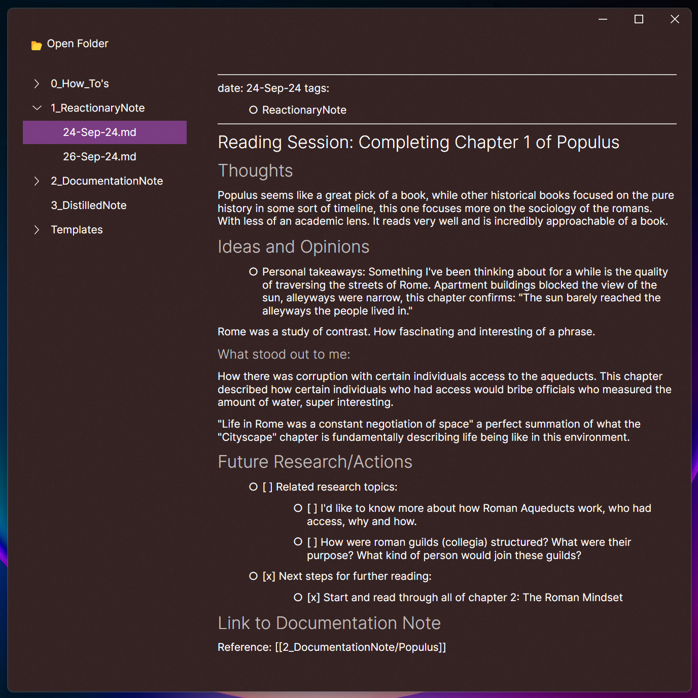

<!-- Title and Badge section -->
<p align="center">
  
</p>

<h1 align="center">Scoria — A Minimalist Markdown Editor</h1>

<p align="center">
  ✨ Clean, minimal but powerful UI. ⚡ Fast, performant 🧪 Powered by Markdig, Avalonia, .NET.
</p>

<p align="center">
  
  
  
</p>

---

## 📸 Preview

<!-- insert screenshots or a demo GIF here -->


---

##  Introduction

<p>
Scoria is an obsidian-inspired markdown text editor aimed at the markdown nerd who wants a bit more hands on control over 
their daily writer, journaling, TODO list and eternal data tracking application.

If you're not familiar with the "file over app" philosophy, I recommend checking out this excellent breakdown by CEO of 
obsidian: https://stephango.com/file-over-app

Scoria's goal is to take the best parts of obsidian and crank the performance x10 by not using a bloated tech stack,
while still implementing core features to enable Scoria to take over as the daily driver of markdown editing you may find yourself needing.

Scoria is not a competitor, it is free and will always be. This project started as simply a frustration with the drawbacks
of electron bloat. I expect the people who use Scoria will be able to rip it apart and add their own custom functionality 
to suit their usecase.
</p>

---

## ✨ Current Features

- 📝 Live Markdown preview
- 🧠 Supports advanced Markdown syntax via [Markdig](https://github.com/xoofx/markdig)
- 🖼️ Toggle between edit and preview modes with `Ctrl+E`
- 📂 Open a folder and explore `.md` files via a responsive TreeView
- 🔄 Auto-renders preview on text changes

---

## 🚧 Planned Features

> A brief breakdown of completed and planned features.

| Date Implemented | Feature                                                                                                                   |
|------------------|---------------------------------------------------------------------------------------------------------------------------|
| 2025-04-29       | ~~Initial Avalonia UI scaffold, editor + preview mode toggle~~                                                            |
| 2025-04-29       | ~~TreeView loads `.md` files from folders and supports nested folders~~                                                   |
|                  | Savable editable markdown text                                                                                            |
|                  | Robust pane system including tabs: Draggable, pivot-able, panels.                                                         |
|                  | Feature rich markdown rendering: Checkboxes, yaml header file properties, bi-directional note linking, images & files etc |
|                  | Settings panel: UI properties and application settings, save settings on startup, project properties.                     |
|                  | Command Palette: Execute searchable commands.                                                                             |
|                  | Search: Search throughout application or folder.                                                                          |
|                  | Advanced data analytics, visual graphs, queries, statistics                                                               |


---

## 🔧 Tech Stack

- [Avalonia UI](https://avaloniaui.net/) – Cross-platform WPF-style UI framework
- [Markdig](https://github.com/xoofx/markdig) – Fast and extensible Markdown parser
- [Markdown.Avalonia](https://github.com/whistyun/Markdown.Avalonia) – Renders Markdown to Avalonia visuals
- [.NET 8]

---

## 📂 Folder Structure

```bash
Scoria/
├── docs/               # Docs, Icons, screenshots, etc.
├── Scoria/             # Project source files 
└── README.md
